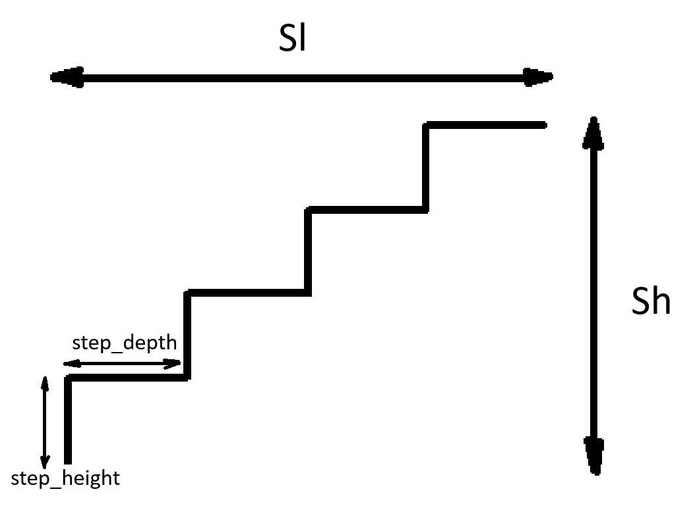

# Schody

## Opis
Aplikacja konsolowa, która oblicza parametry schodów, takie jak liczba stopni, wysokość stopnia i głębokość stopnia na podstawie podanych przez użytkownika całkowitych wymiarów schodów. Program sprawdza również, czy wyliczone parametry są zgodne z określonymi warunkami technicznymi (wysokość i głębokość stopni).

Dane wejściowe:
- całkowita wysokość schodów `Sh`
- całkowita głębokość schodów `Sl`

Dane wyjściowe:
- ilość stopni `num_steps`
- wysokość stopnia (od 16 do 18) `step_height`
- głębokość stopnia (od 25 do 32) `step_depth`

Rys. 1. Schemat schodów.

## Struktura projektu

Projekt składa się z trzech głównych plików:
- `function.cpp` - zawiera funkcję `calculate_stairs`, która oblicza parametry schodów.
- `main.cpp` - funkcja główna programu, która pobiera dane wejściowe od użytkownika i wyświetla wynik obliczeń.
- `main_test.cpp` - zestaw testów jednostkowych sprawdzających poprawność działania funkcji `calculate_stairs`.

## Plik: function.cpp

### Struktura: `StairsResult`

Struktura `StairsResult` przechowuje wyniki obliczeń:
- `num_steps` - liczba stopni
- `step_height` - wysokość pojedynczego stopnia
- `step_depth` - głębokość pojedynczego stopnia
- `success` - wartość logiczna wskazująca, czy obliczenia zakończyły się sukcesem
- `message` - wiadomość informacyjna o wyniku obliczeń

Dodatkowo struktura zawiera przeciążony operator `==`, który umożliwia porównywanie dwóch obiektów `StairsResult`.

### Funkcja: `calculate_stairs`

Funkcja `calculate_stairs` oblicza parametry schodów na podstawie podanych parametrów:
- `Sh` - całkowita wysokość schodów
- `Sl` - całkowita głębokość schodów

Funkcja sprawdza, czy wyliczone parametry są zgodne z określonymi warunkami technicznymi:
- Wysokość stopnia musi mieścić się w zakresie od 16 cm do 18 cm.
- Głębokość stopnia musi mieścić się w zakresie od 25 cm do 32 cm.

#### Zwracane wartości
Funkcja zwraca obiekt `StairsResult` z wypełnionymi wartościami liczby stopni, wysokości i głębokości stopnia. Jeśli obliczenia nie spełniają wymagań, funkcja zwraca `success` ustawione na `false` i odpowiednią wiadomość w `message`.

`function.cpp`

Plik: main.cpp

Plik main.cpp zawiera funkcję main, która odpowiada za interakcję z użytkownikiem:

- Pobiera od użytkownika całkowitą wysokość i głębokość schodów.
- Wywołuje funkcję calculate_stairs, aby obliczyć parametry schodów.
- Wyświetla wynik obliczeń lub komunikat o błędzie, jeśli obliczenia się nie powiodły.

`main.cpp`

Plik: main_test.cpp

Plik main_test.cpp zawiera zestaw testów jednostkowych dla funkcji calculate_stairs. Testy są realizowane przy użyciu frameworka Google Test.
Kategorie testów

Testy zostały podzielone na trzy główne grupy:

- Schody możliwe: Testy sprawdzające, czy obliczenia są poprawne dla prawidłowych wartości wejściowych.
- Zła głębokość: Testy sprawdzające, czy funkcja poprawnie obsługuje przypadki, gdy całkowita głębokość schodów przekracza dopuszczalną wartość.
- Zła wysokość: Testy sprawdzające, czy funkcja poprawnie obsługuje przypadki, gdy wysokość stopnia nie mieści się w zakresie dopuszczalnych wartości.

`main_test.cpp`

#include <iostream>
#include <cmath>
#include <limits>

int main() {
    // Zmienna całkowitej wysokości i głębokości schodów
    double Sh, Sl;
    std::cout << "Podaj całkowitą wysokość schodów (Sh): ";
    std::cin >> Sh;
    std::cout << "Podaj całkowitą głębokość schodów (Sl): ";
    std::cin >> Sl;

    // Zmienna do przechowywania najbardziej optymalnych wyników
    int bestSteps = 0;
    double bestHeight = 0, bestDepth = 0;
    double minDepthDiff = std::numeric_limits<double>::max();

    // Pętla dla każdej możliwej wartości wysokości stopnia od 15 do 19
    for (int stepHeight = 15; stepHeight <= 19; ++stepHeight) {
        int steps = static_cast<int>(Sh / stepHeight);

        // Sprawdzamy czy liczba stopni razy wysokość stopnia równa się Sh
        if (steps * stepHeight == Sh) {
            // Obliczamy odpowiednią głębokość stopnia tak, aby nie przekroczyć Sl
            for (int stepDepth = 50; stepDepth <= 70; ++stepDepth) {
                double totalDepth = steps * stepDepth;

                // Sprawdzamy czy głębokość całkowita jest mniejsza od Sl
                if (totalDepth <= Sl) {
                    double depthDiff = Sl - totalDepth;

                    // Wybieramy najbardziej optymalną głębokość
                    if (depthDiff < minDepthDiff) {
                        minDepthDiff = depthDiff;
                        bestSteps = steps;
                        bestHeight = stepHeight;
                        bestDepth = stepDepth;
                    }
                }
            }
        }
    }

    // Wyświetlenie najbardziej optymalnych wyników
    if (bestSteps > 0) {
        std::cout << "Optymalna liczba stopni: " << bestSteps << std::endl;
        std::cout << "Wysokość jednego stopnia: " << bestHeight << " cm" << std::endl;
        std::cout << "Głębokość jednego stopnia: " << bestDepth << " cm" << std::endl;
    } else {
        std::cout << "Nie znaleziono rozwiązania dla podanych wymagań." << std::endl;
    }

    return 0;
}

